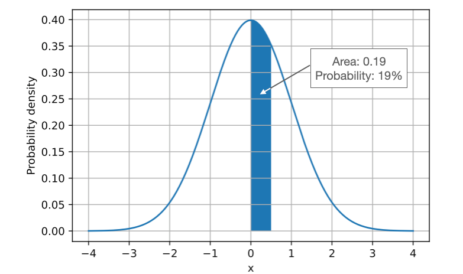
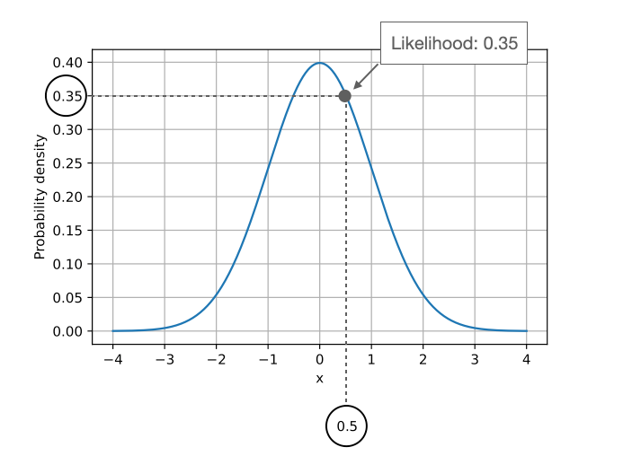

# Probabilty

Using the term probability, we calculate how probable (or likely) it is to draw a sample from a given distribution with certain parameters. For example, considering a continuous distribution like the normal distribution, we compute the probability as the area under the curve for a given range of values for the data x
. We do this by integrating the probability density function with fixed parameters: for the normal distribution, these parameters are the mean and standard deviation. The figure below illustrates this concept by calculating the probability of drawing a sample x
 with a value between 0 and 0.5 for a standard normal distribution (mean 0 and standard deviation 1), that is,

 As illustrated by the previous figure, probability quantified how probable it is to sample data (x
) with certain values from a given distribution given the parameters (w
) of the distribution. On the other hand, the likelihood, L(w|x)
, computes how likely the parameters are given the observed data – in a practical context, we change the parameters of the distribution and see how it affects the likelihood. The figure below illustrates how we can obtain the likelihood of a fixed data point x=0.5
:

## References
1. <https://sebastianraschka.com/faq/docs/probability-vs-likelihood.html>
